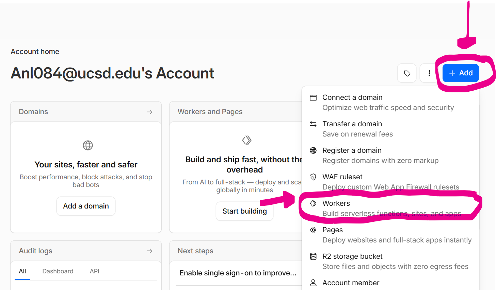
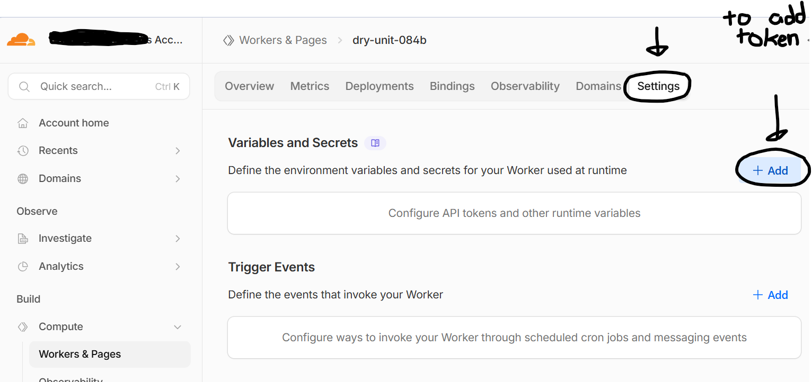
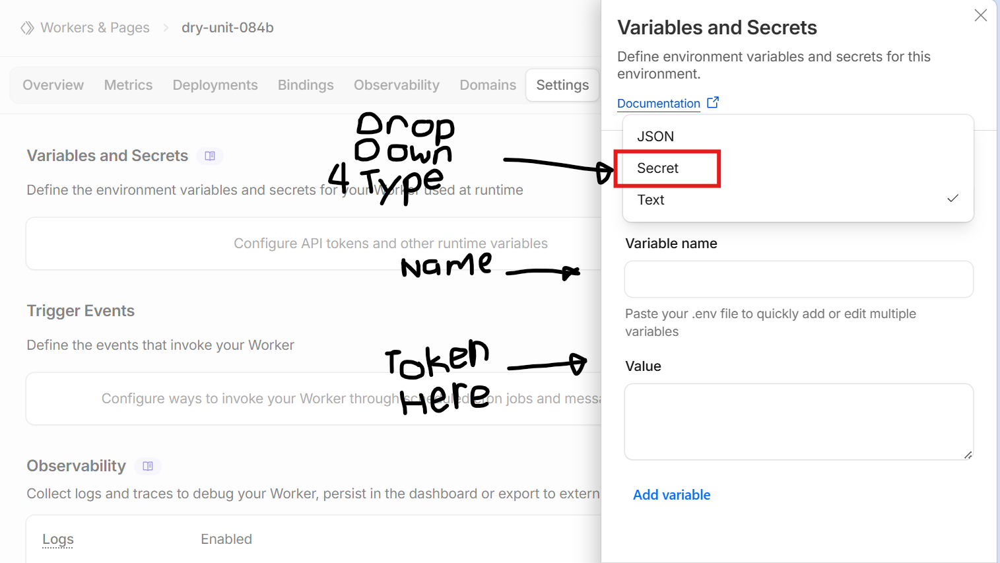
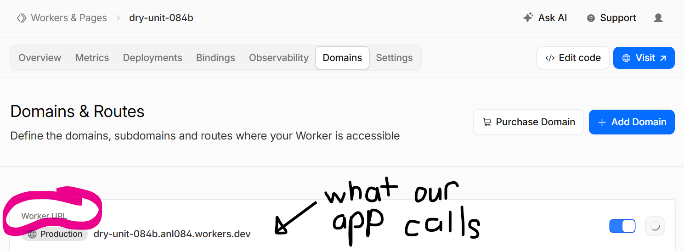

## Replicate with Cloudfare

---

**Current Structure Flow** - User → Frontend → Cloudflare Worker → Replicate → Cloudflare Worker → User

---

### How to use

1.  Go to [Replicate's Dashboard](https://replicate.com/account/api-tokens)
    - You may need to login via Github
2.  Generate an API token
    - **Do Not Share the Token, Treat it as a password, DON't Commit to Github**
    - The token is used for **identifying your account** and tracks your **billing/usage**
    - That’s why protecting the token matters:

    - **Precaution Warning**
      - **Anyone with the token can use your account credits/billing**
      - **If leaked publicly, people could run expensive models on your account**

      - Good practices:
        - Store it in environment variables
        - Use .env files locally
        - Add .env to .gitignore
        - Rotate/revoke tokens if exposed (via [replicate dashboard](https://replicate.com/account/api-tokens))

3.  Create a Cloudflare Account and enable Workers, Pages and R2
    - Create New Worker - Add Secret like REPLICATE_API_KEY
      - First click the Blue Add Button on the top right
      - Then Click On Add Workers
        - 
      - Select Start with Hello World to add code
        - (Uploading static files only for images, logos and things you want permanently for image assets)
      - Then Go to settings and on top will be a variable and secrets portion
        - 
      - Then add your Replicate API key as a secret
        - Type: Secret (This is a Dropdown menu thing)
        - Name: REPLICATE_API_TOKEN //This is the name of the variable
        - Value: your Replicate API key //This is th actual token, **DONT MIX IT UP**
        - 

4.  (Optional to do as Supplemental Reading)
    - Example of Basic Worker Code


        ```
        export default {
            async fetch(request, env) {
                const body = await request.json();

                const response = await fetch("https://api.replicate.com/v1/predictions", {
                method: "POST",
                headers: {
                    "Authorization": `Token ${env.REPLICATE_API_TOKEN}`,
                    "Content-Type": "application/json"
                },
                body: JSON.stringify({
                    version: body.version,
                    input: body.input
                })
                });

                const data = await response.json();

                return Response.json(data);
            }
        };
        ```

    - After You have the code, Our App Calls https://your-worker-name.workers.dev
      - 
    - Then we send a JSON request to it
      - ```
            {
                "version": "model_version_id",
                "input": {
                    "image": "https://example.com/photo1.jpg",
                    "face": "https://example.com/photo2.jpg"
                }
            }
        ```

    - Then It waits for the request with something like `const var = await request.json`
    - The Cloudflare calls replicate through a fetch function
    - Then we get something like this every so often
      - ```
            {
                "id": "prediction_123",
                "status": "starting"
            }
        ```
    - Until it succeeds and we get - `                 {
                    "status": "succeeded",
                    "output": "https://replicate.output/image.jpg"
                }
          `
      **More complicated stuff will be left to replicate info tab**
