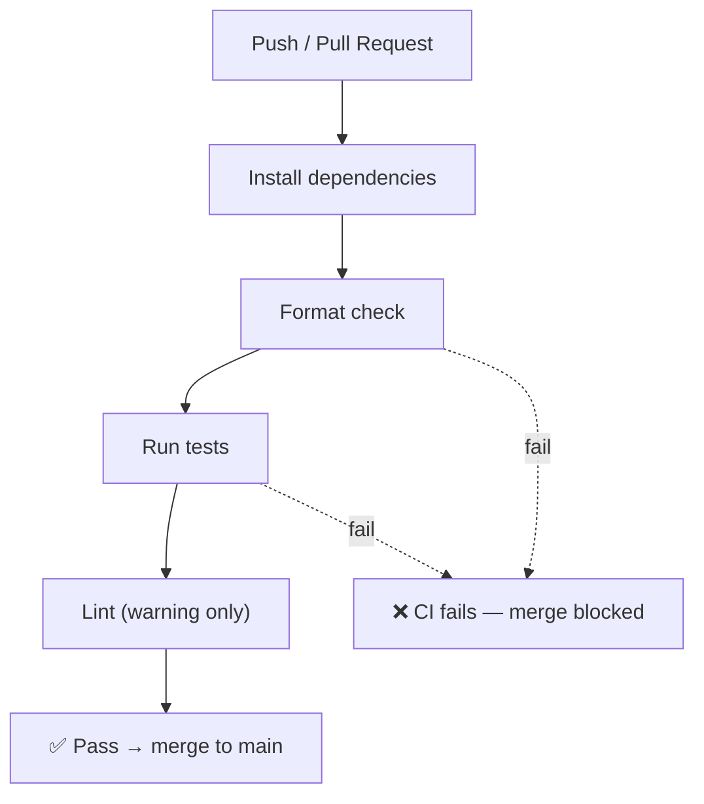

# CI Pipeline

Every **push** or **pull request** automatically runs our checks on GitHub Actions.

- **Format** and **tests** must pass — if they fail, the merge is blocked.
- **Lint** is a warning only (it never blocks a merge).
